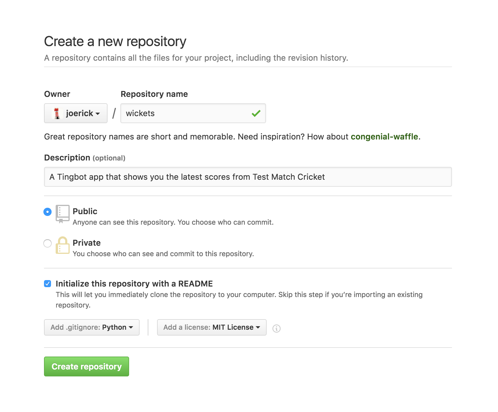

Publishing your app to the Ocean
================================

[The Tingbot Ocean](http://ocean.tingbot.com) is the open-source app store for Tingbot. On the Ocean you can check out what other people have made, and post your own app for other people to use.

Getting your app ready
----------------------

There are a few things you need to have before putting your app on the Ocean:

- An app that's fun or useful
- An [app icon](/reference/tingapp-format/#icon)
- Properly filled out [app.tbinfo file](/reference/tingapp-format/#tbinfo)

Next up, you'll need to make your app downloadable on the web. Our favourite way to do this is post it to GitHub. 

Posting to GitHub
-----------------

If you're familiar with git and GitHub, then put your tingapp folder *inside* a repo and skip to the next step. If you're not sure how to do that, read on.

First up, make sure you've got Git installed. Install for [Mac](https://www.atlassian.com/git/tutorials/install-git/mac-os-x), [Win](https://www.atlassian.com/git/tutorials/install-git/windows), or [Linux](https://www.atlassian.com/git/tutorials/install-git/linux).

Create an account at GitHub by going to [github.com](http://github.com), clicking the 'Sign up' button, and follow the instructions.

Once you've got an account, click the ➕ button in the top right and choose 'New repository'.

> *Note*
>
> A repository (or 'repo' for short) is where your code lives. Git repositories also keep track of every change in your code, so you can make changes without worrying that you might break something!

- For the **name**, enter your tingapp name, without the '.tingapp' part.
- You can add a short **description** of what your app does.
- Leave it on the **Public** setting
- **Tick** the 'Initialize this repository with a README' checkbox
- Choose a **Python** .gitignore file
- Choose an open source license. We recommend an '**MIT License**', because it's nice and simple. For more information, check [choosealicense.com](http://choosealicense.com/)

By now, the page should look something like this:

All set? Hit the big green button!

On the next screen, you'll see your new repository. Copy your Git URL from the 'Clone or download' button.

Now open a terminal ('Git Bash' on Windows) and type

    git clone <paste your git URL here>

Git will download your repo, into a folder with the name you chose earlier. Now you can add your app, by copying it into the folder that was created.

Finally, we can push it to GitHub. Go back to the terminal and type:

    cd <your repo name>
    git add .
    git status

Git will output a list of files that are going to be added. Give it a look over and make sure there's nothing there you don't want to publish. If there is anything, remove the files and do `git add .` again.

Finally, to push to GitHub, type

    git commit
    git push

Check your repo page on GitHub, you should see your app appear!

Adding it to the Ocean
----------------------

Tingbot Ocean is also hosted on GitHub. To add your app, go to the [_data/apps.yaml](https://github.com/tingbot/ocean/blob/gh-pages/_data/apps.yaml) page and add an entry for your app.

Click the <i class="fa fa-pencil" aria-hidden="true"></i> pencil icon to edit, and then add your app. Just copy one of the existing entries and fill in your own information. Fields of note-

* `icon` - this is a URL to your app's icon. An easy way to point at your app's icon is to use the GitHub 'raw' URL, which has the format: `https://raw.githubusercontent.com/<username>/<appname>/master/<appname>.tingapp/icon.png`
* `zip_url` - A URL to a zip download of the app. Again, GitHub makes this easy - `https://github.com/<username>/<appname>/archive/master.zip`
* `github_url` (optional) - If the app's hosted on GitHub, the GitHub repo link - `https://github.com/<username>/<appname>`
* `screenshot_url` (optional) - a URL to a screenshot of your app

Save your change, and we'll get a pull request for your app. We'll take a quick look to review and then you should be live!
