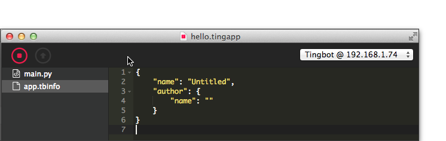

// TODO: first-run setup instructions
// incl. Tingbot assembly, download image, flash to SD, Wifi setup

Introduction
============
Installing Tingbot OS on the Tingbot's SD card and installing the Tide application (Tingbot's integrated development environment) on your computer are the first steps to getting your new Tingbot up and running.

Installing Tingbot OS
=====================
Download Tingbot OS
----------------
Visit [github link here] to download the Tingbot disk.img.zip and then expand this to disk.img. On the Mac the result will look like:

We recommend the use of a micro SD card of 8GB or more. As there are a number of ways of writing the Tingbot OS image to the SD card we can’t cover all options. However, the easiest way we have found to prepare the SD card is to use Etcher by Resin.io and we recommend this approach and document it below.

Download and Install Etcher
---------------------------
Visit www.etcher.io and download Etcher from there. Here's a screenshot of the home page and as you can see it has detected the Apple Mac that's being used to write and screenshot this tutorial.

Use Etcher to burn the Tingbot OS disk image
--------------------------------------------
Once Etcher has been installed it can be used to burn the Tingbot OS image to the micro SD card. As follows.

### Select the Tingbot OS image

### Select the Drive image

> **Aside:**
> The above screenshot shows the selection of the Mac's drive that corresponds to the in-built SD card slot that has had the micro SD card inserted (in its SD card adapter). Please make sure on your own machine that the correct drive is selected!

### Flash the image
The time it will take to flash the 1.5GB image will depend on the speed of the micro SD card. Etcher provides a handy ETA to completion!

### Flash complete!

> **Aside:**
> The CRC32 checksum in the above image is likely to be different to the one reported for the final release version.

Installing Tide
===============
Now it's time to download and install the Tide application. Visit https://tide-download.tingbot.com

### Tide's up!
When invoked Tide starts up with an untitled - hello world - template program file. You can find out more about this in the 'Writing your first app' section.

 
### Setting up Wifi
Configuring the WiFi settings on the Tide OS SD card is the next step. To make this as simple as possible the Tide application has a special Tingbot WiFi Settings... menu item. For instance in the Mac UI this is in the Tide menu:

> **Aside:**
> If the Tingbot OS SD card isn't inserted you may get the following prompt:
>

Now enter the SSID name and password in the pop-up window:

and when saved to the SD card the following confirmation will be given:

### Time to get coding!
It's now time to get coding so please now eject the Tingbot OS SD card, insert the micro SD card into the Tingbot and plug in the Tingbot power supply. As this is the first time the SD card has been used the Tingbot it will go through a partial boot up sequence to expand the image to the full capacity of the SD card. Once the image has been expanded the Tingbot will automatically reboot - this time into Springboard - the Tingbot's UI.

Using Tide
----------
### Save as... (and Run)
The first thing to do is to use File -&gt; Save As... (or File -&gt; Save) to save the Untitled template Tingbot application as, say, a file named hello.tingapp. Now 'Run' the program in the Tingbot simulator and the simulated Tingbot will pop up!

### The real ting!
At this point we're sure that you'd like to run the app on the actual Tingbot. Nothing could be simpler! If your Tingbot is booted up then it should be showing the first screen of Springboard. If so all is well. If not, please check back over the previous instructions. If the Tingbot has been able to connect to WiFi then the Tide application should have detected it and the Tingbot's local IP address will appear in the top right hand menu. For instance:  

Now select the real Tingbot rather than the simulator and once this is done notice that the Download button is now activated. Clicking on this button will cause hello.tingapp to be downloaded to the Tingbot. 

> **Aside:**
> Scrolling through Springboard will show the newly installed application as 'Untitled' but we'll explain why later.
> If you have scrolled to Untitled you can start it by tapping its screen icon.

When developing code it is often more convenient to wrap the download and run into one step. That's what the Run button achieves and clicking on this will download the app and start it running on the Tingbot. The following screenshot shows this. Note that the button icon changes from 'play' to 'stop' when the app has been started by this method:

### One last Ting!
The reason that the Hello app shows up in Springboard as 'Untitled' is because the app.tbinfo has not been updated by the programmer. The first screenshot below shows the default app.tbinfo settings (and active 'Stop' button) and the second screenshot shows an updated app.tbinfo (and active 'Play' and 'Download' buttons showing that the app has been stopped in preparation for an update and re-run).

Now it's time to explain the process of writing your first Tingbot app. This comes next!

