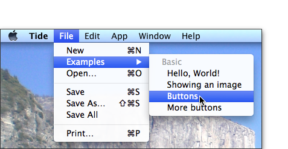
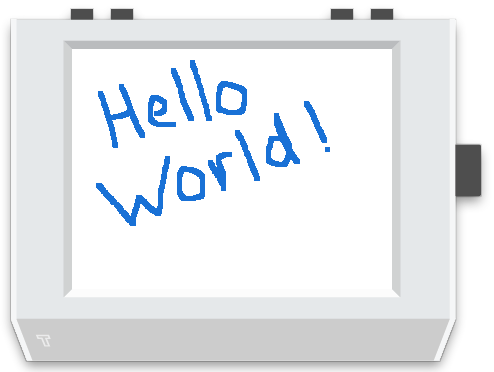

Buttons
=======

If the version of Tide you installed is one that includes button examples then these can be selected from the **File -&gt; Examples** menu. For instance:



will load the **Buttons** example code (below) into Tide.

    # Button presses can be received by using the @button.press
    # decorator. There are four buttons on Tingbot:
    #
    #   @left_button.press
    #   @midleft_button.press
    #   @midright_button.press
    #   @right_button.press

    import tingbot
    from tingbot import *

    state = {'number': 0}

    @left_button.press
    def press():
        state['number'] -= 1

    @right_button.press
    def press():
        state['number'] += 1

    @every(seconds=1.0/30)
    def loop():
        screen.fill(color='black')
        screen.text(state['number'], color='green')

    tingbot.run()

To 'press' the buttons in the simulator just position the mouse cursor over one of the buttons and click. The screen shot below shows the state of play just before the right - incrementing - button is pressed. It's left as an exercise for the reader to work out what will happen when it is pressed ;).
 

More buttons
-------------
Now let's move on to a slightly more animated example that shows all four types of button event available in Tide. Now load the **More buttons** example code (below) into Tide.

    # Each button also has four events - down, up, press and hold.
    #
    # Try pressing or holding the right button to see when each
    # event is triggered.

    import tingbot
    from tingbot import *

    @right_button.down
    def down():
        screen.rectangle(color='red', size=(1,50), align='topright')
        screen.text('down', font_size=12, align='topright')

    @right_button.press
    def next():
        screen.rectangle(color='green', size=(1,50), align='right')
        screen.text('press', font_size=12, align='right')

    @right_button.hold
    def next():
        screen.rectangle(color='blue', size=(1,50), align='right')
        screen.text('hold', font_size=12, align='right')

    @right_button.up
    def next():
        screen.rectangle(color='white', size=(1,50), align='bottomright')
        screen.text('up', font_size=12, align='bottomright')

    screen.fill(color='black')

    @every(seconds=1.0/30)
    def loop():
        # This moves everything on the screen left by 1px
        screen.surface.scroll(-1, 0)
        screen.rectangle(color='black', size=(1,240), align='right')

    tingbot.run()

When the above is run the screen contents will continually scroll from right to left. A vertical line - a 1-pixel wide by 240 pixels high rectangle the same colour as the screen background - is 'inserted at the right hand side of the screen to fill the 'gap' made by moving the contents of the screen one pixel to the left. This is a simple way to 'animate' the display. The following screenshot of the Tingbot simulator captures one frame of the action.

 

Of course the best way to fully understand what's going on is to run this **More buttons** example for yourself!

Touch
=====
The Tingbot display is touch sensitive as it uses a resistive screen consisting of a number of layers. When the screen is pressed, the outer later is pushed onto the next layer — the technology senses that pressure is being applied and registers input. In effect it is sensitive to pressure from, for example, a finger or stylus.

Basic drawing app
-----------------
It couldn't be simpler to use this in-built touch feature of Tingbot to create a basic drawing app in Tide.

    import tingbot
    from tingbot import *

    screen.fill(color='white')

    @touch()
    def on_touch(xy):
        screen.rectangle(
            xy=xy,
            size=(5, 5),
            color='blue')

    tingbot.run()

 

> **Aside:**
> It would be convenient to have the ability to clear the screen between doodles. Using our new-found knowledge of button events this could be done by simply adding, for example:

    @left_button.hold
    def clear():
        screen.fill(color='white')

> to give our new and improved version:

    import tingbot
    from tingbot import *

    screen.fill(color='white')

    @left_button.hold
    def clear():
        screen.fill(color='white')

    @touch()
    def on_touch(xy):
        screen.rectangle(
            xy=xy,
            size=(5, 5),
            color='blue')

    tingbot.run()

> Try it and see!

Smooth!
-------

One of the challenges of using a touch-enabled display under the direct control of a Raspberry Pi is the sampling rate of the position at the point of touch. So the doodled **Hello World!** in the screen shot above had to be drawn steadily and relatively slowly to make sure that the letters were solid. Doodling quickly may leave gaps since the touch position could have moved to coordinates beyond the ability of the rectangle - i.e one with ```size=(5,5)``` [see above] pixels - to cover the gap.

One approach to mitigating this issue is to draw a line between the previous point of touch and the current point of touch rather than just plonk down coloured pixels at the current touch coordinate. This technique is demonstrated in the following enhancement to the simple drawing app:

    import tingbot
    from tingbot import *

    state = {
        'previous_xy': None
    }

    screen.fill(color='white')

    @left_button.hold
    def clear():
        screen.fill(color='white')

    @touch()
    def on_touch(xy, action):
        if state['previous_xy']:
            screen.line(
                state['previous_xy'],
                xy,
                width=5,
                color='blue')

        if action == 'up':
            state['previous_xy'] = None
        else:
            state['previous_xy'] = xy

    tingbot.run()

The difference is quite striking when compared side-by-side as you can see in the screen grab below with the original version on the left and the smoothing version on the right. Both crosses were drawn at the same speed.

 

> **Aside:**
> The technique shown above is, strictly speaking, interpolation rather than smoothing but we couldn't resist (no pun intended) the chance to use **Smooth!** as a heading ;)

