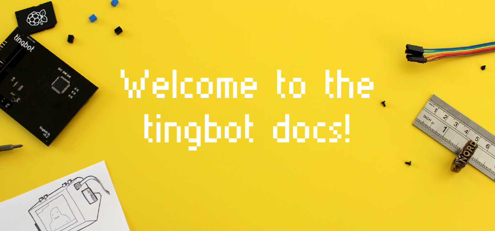

Here you'll find all the information you'll need to build your Tingbot and get started writing apps.

🔨 Just got your kit? [Check out the setup guide](/guides/setup/)

🎈 Want to write a simple app? [First app tutorial](/guides/first-app/)

🔩 Looking for information on our Python libraries? [tingbot-python reference](/links/tingbot-python-docs/)

🌊 Check out other apps made by the community at [The Tingbot Ocean](http://ocean.tingbot.com)

## Get in touch!

<!-- 
### [Tingbot Forum <i class="fa fa-comment" aria-hidden="true"></i>](http://forum.tingbot.com)

[The forum](http://forum.tingbot.com) is a great place to ask for help when you're getting started. Ask your questions here so they can be picked up by Google!
 -->

### [Support <i class="fa fa-envelope" aria-hidden="true"></i>](mailto:support@tingbot.com)

For support, email us directly at [support@tingbot.com](mailto:support@tingbot.com).

### [Tingbot Slack <i class="fa fa-slack" aria-hidden="true"></i>](http://slack.tingbot.com)

Prefer to chat in realtime? The [Tingbot Slack channel](http://slack.tingbot.com) is open to all who want to talk Tingbot. We also have channels to discuss contributions to the Github platform on the Slack.

### [Our Github projects <i class="fa fa-github" aria-hidden="true"></i>](http://github.com/tingbot)

All Tingbot software is liberal licensed, open source.

Found a bug in one of our projects? Want to contribute?

- [tingbot-python](https://github.com/tingbot/tingbot-python) (the Python libraries)
- [tide-electron](https://github.com/tingbot/tide-electron) (the Tide IDE application)
- [tingbot-os](https://github.com/tingbot/tingbot-os) (the Tingbot operating system)
