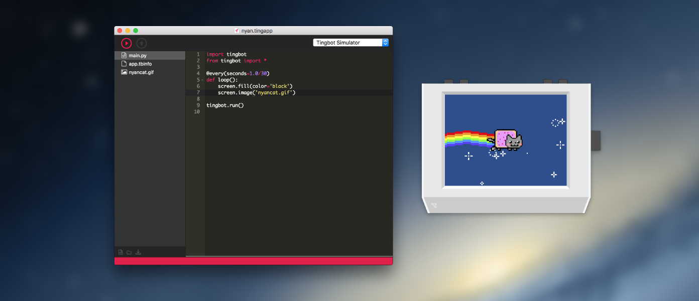

# Tide

Tide is the IDE for Tingbot.

## Download 

<table>
    <thead>
        <th>
            <i class="fa fa-apple" aria-hidden="true"></i> Mac
        </th>
        <th>
            <i class="fa fa-windows" aria-hidden="true"></i> Windows
        </th>
        <th>
            <i class="fa fa-linux" aria-hidden="true"></i> Linux
        </th>
    </thead>
    <tbody>
        <tr>
            <td>
                <a href="http://tide-download.tingbot.com/download/osx">Download DMG</a>
            </td>
            <td>
                <a href="http://tide-download.tingbot.com/download/win">Download EXE</a>
            </td>
            <td>
                <a href="http://github.com/tingbot/tide-electron/releases/latest">Download DEB or RPM</a>
            </td>
        </tr>
    </tbody>
</table>

Once you've installed Tide, check out the examples in the menu at **File** > **Examples**, or maybe try the [first app](/guides/first-app) guide!

## Contributing

Tide is completely open source, built in Javascript using the Electron framework. Interested how it's built or want to get involved? Check out out [Github](http://github.com/tingbot/tide-electron)!
